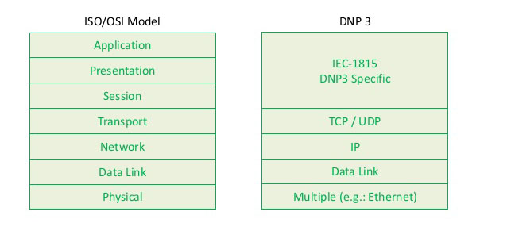
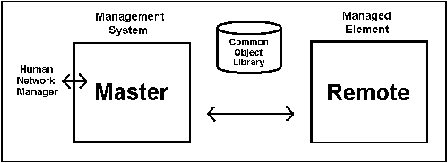

## DNP3




In a typical DNP3 network, information is passed from the Remote up to the Master. Usually the Master requests the information from the remote, but in the case of alarms, the remote will initiate an exchange rather than wait for a request from the Master. This assures that alarms are attended to in a timely manner.

Protocol structure:


  * **Magic** - 2 starting octets of the header (0x0564). 
  * **LENGTH** - 1  octet  count  of  USER  DATA  in  the  header  and  body.    This  count  includes  the  
  * **CONTROL, DESTINATION and SOURCE** -  fields in the header however the CRC and 


General:

 * TCP Port: 20000
 * data aquisition from remote devices;
 * C++ Implementation: https://github.com/automatak/dnp3

## DNP3 Simulators

C++: https://github.com/automatak/dnp3
Docs: https://www.automatak.com/opendnp3/docs/guide/current/build/cmake/

Use *--recursive* when cloning:
```
git clone --recursive https://github.com/automatak/dnp3.git
```

Qt4:
https://sourceforge.net/projects/dnp/

## DNP3 Identification:

1. Shodanhq dork: port:20000

2. Using **nmap** with script **dnp3-info.nse**: https://github.com/sjhilt/Nmap-NSEs/blob/master/dnp3-info.nse

```
# Add script to nmap directory
$ sudo mv dnp3-info.nse /usr/share/nmap/scripts/

# Update nmap db
$ sudo nmap --script-updatedb

# Start scanner
$ nmap 14.39.81.63 --script=dnp3-info
```

## Exploit and stuff:

Fuzzers:

  * Aegis: https://www.automatak.com/aegis/
  * Achilles Test Platform: https://www.ge.com/digital/products/achilles-vulnerability-testing-platform
  * Peach Fuzzer: https://www.peach.tech/wp-content/uploads/DNP3_DataSheet.pdf

## Conclusions

Resources:

  * **!!! Quick Refference:** http://read.pudn.com/downloads151/doc/comm/655523/DNP3QuickReference.pdf
  * OpenDNP3 Decoder and stuff: https://www.automatak.com/opendnp3/#documentation
  * DNP3 User manual: http://www.multitrode.com/assets/product-manuals/protocol-translator-dnp3-user-manual.pdf
  * Protocol description: https://www.ixiacom.com/company/blog/scada-distributed-network-protocol-dnp3