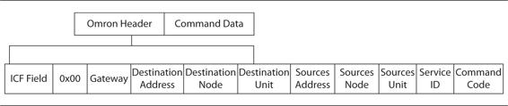

## FINS (Factory Interface Network Service)

Wireshark Wiki: https://wiki.wireshark.org/OMRON-FINS

For OMRON-FINS over UDP the frame structure is the following:



## Simulator:

You can use ths one: https://github.com/hiroeorz/omron-fins-simulator

```bash
$ git clone https://github.com/hiroeorz/omron-fins-simulator.git
$ cd omron-fins-simulator
$ ruby omron_plc.rb --address=127.0.0.1 --port=9600
```


## Scan

1.Shodan: port:9600

2.Nmap script: https://nmap.org/nsedoc/scripts/omron-info.html

```
$ sudo nmap --script omron-info -sU -p 9600 10.0.0.1
```

## Omron FINS - Clients

LibFINS: https://github.com/lammertb/libfins