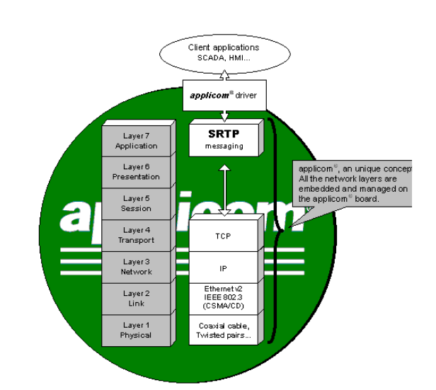

## GE-SRTP (Service Request Transport Protocol)



Documentation: http://platforma.astor.com.pl/files/getfile/id/1277

## Scan

Default used ports: *18245* or *18246* on TCP

Shodan drok:

```
port:18245,18246 product:"general electric"
```