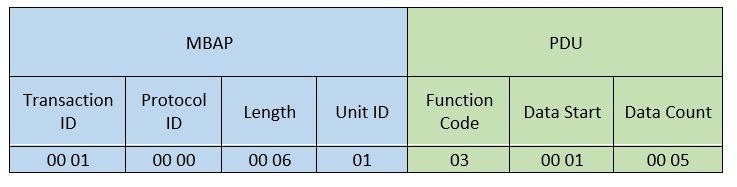

## Theory
Modbus was introduced in 1979 and was not designed to be available on public networks! *Devices using this protocol should not be available on the internet under any circumstances*! Basically, if I can see this protocol via Internet then I own your device! 

This protocol is **build upon model a request and replay model**! It uses *function codes* in combination with data section to request/send data!  

Modbus function codes and their description:

| Function| Description								  |
| ------- | --------------------------------------	  |
| FC=01	  | Read Coil Status						  |
| FC=02	  | Read Input Status						  |
| FC=03   | Read multiple holding registers           |
| FC=04   | Read Input Registers                   4  |
| FC=05   | Write Single Coil                         |
| FC=06   | Write Single Holding Register             |
| FC=07   | Read Exception Status                     |
| FC=08   | Diagnostics                               |
| FC=11   | Get Comm Event Counter **(RTU)**          |
| FC=12   | Get Comm Event Log **(RTU)**              |
| FC=14   | **Read Device Identification**            |
| FC=15   | Write multiple coils                      |
| FC=17   | Write multiple holding registers          |
| FC=20   | Read file record                          |
| FC=21   | Write file record                         |
| FC=22   | Mask Write Register                       |
| FC=23   | Read/Write Multiple Registers             |
| FC=24   | Read FIFO Queue                           |
| FC=43   | **Read Device Identification**            |
| FC=90   | Implement new function                    |

COILS = Digital values, REGISTERS = analogic values

Function codes are used to build modbus packet which is going to be send over TCP/IP. The modbus packet have the following format:



Shodan dork: *port:502*

##### The MBAP includes the following:

  * A **Transaction ID** and 2 bytes set by the client to uniquely identify each request. These bytes are echoed by the server since its responses may not be received in the same order as the requests.
  * A **Protocol ID** and 2 bytes set by the client. Always equals 00 00.
  * The **Length** and 2 bytes identifying the number of bytes in the message to follow.
  * The **Unit ID** and 1 byte set by the client and echoed by the server for the identification of a remote slave connected on a serial line or on some other communication medium.

## Simulate a Modbus Server

Library pyModbus is used in order to achieve this task!
Official documentation and stuff is here: https://pymodbus.readthedocs.io/en/latest/index.html

#### 1. Install dependencies

```
$ sudo apt-get install python-pip
$ sudo -H pip install cryptography awscli pyModbus
```

#### 2. Script to start the server

```python
#!/usr/bin/env python
# Pymodbus Asynchronous Server Example

# import the various server implementations 
from pymodbus.server.async import StartTcpServer
from pymodbus.server.async import StartUdpServer
from pymodbus.server.async import StartSerialServer

from pymodbus.device import ModbusDeviceIdentification
from pymodbus.datastore import ModbusSequentialDataBlock
from pymodbus.datastore import ModbusSlaveContext, ModbusServerContext
from pymodbus.transaction import ModbusRtuFramer, ModbusAsciiFramer

# configure the service logging
import logging
logging.basicConfig()
log = logging.getLogger()
log.setLevel(logging.DEBUG)

store = ModbusSlaveContext(
    di = ModbusSequentialDataBlock(0, [17]*100),	# Discrete inputs initializer
    co = ModbusSequentialDataBlock(0, [17]*100),	# Coils initializer
    hr = ModbusSequentialDataBlock(0, [17]*100),	# Holding register initializer
    ir = ModbusSequentialDataBlock(0, [17]*100))	# Input registers initializer
context = ModbusServerContext(slaves=store, single=True)

# initialize the server information
identity = ModbusDeviceIdentification()
identity.VendorName  = 'Pymodbus'
identity.ProductCode = 'PM'
identity.VendorUrl   = 'http://github.com/bashwork/pymodbus/'
identity.ProductName = 'Pymodbus Server'
identity.ModelName   = 'Pymodbus vServer'
identity.MajorMinorRevision = '1.0'
 
# run the server you want 

# Modbus over Ethernet via IP
StartTcpServer(context, identity=identity, address=("localhost", 502))
#StartUdpServer(context, identity=identity, address=("127.0.0.1", 502))

# Serial
#StartSerialServer(context, identity=identity, port='/dev/pts/3', framer=ModbusRtuFramer)
#StartSerialServer(context, identity=identity, port='/dev/pts/3', framer=ModbusAsciiFramer)
```
Save as: *python_server.py*

Original script: https://pymodbus.readthedocs.io/en/latest/examples/asynchronous-server.html

Very usefull when there is an HMI requesting data from a PLC via Modbus! In this case, using the server above, you alter data received by HMI! The point is to *manipulate HMI (human machine interface) to take actions according to your fake data*!
For example, by manipulating displayed value for a temperature cooker, an attacker can make the operator think the temperature is too low or too high and have him/her act upon manipulated data!

#### 3. Start modbus server:
```$ sudo python modbus_server.py```

as an alternative, if you want a graphical interface, you can use EasyModbusTCPServer Simulator: https://sourceforge.net/projects/easymodbustcpserver/

## Identify modbus devices on a network

**nMap** is required:

```$ sudo apt-get install nmap```

  * Identify online hosts with mbap header on the network.
  
    ```$ nmap -Pn -sT -p502 --script=modbus-discover 10.0.0.1/24```

  * Scan only a target
  
    ```$ nmap 10.0.0.100 -p502 --script=modbus-discover```
	
Script detection: https://nmap.org/nsedoc/scripts/modbus-discover.html

**BUT, a passive scan is recommended in SCADA environments: [scan.md](../scan.md)**

## Modbus clients

If you want to test on local, make sure you have started modbus server!

Before starting, you have to know what to read and from what location! *The Modbus commands supports the addressing areas **1...99999 for coils** and **400001...499999** for the rest using Modicon addresses!*

### 1. modbus-cli

| Data type                 | Data size | Schneider address | Modicon address   | Parameter |
| ------------------------- | --------- | ----------------- | ----------------- | --------- |
| Words (default, unsigned) | 16 bits   | %MW1              | 400001            | --word    |
| Integer (signed)          | 16 bits   | %MW1              | 400001            | --int     |
| Floating point            | 32 bits   | %MF1              | 400001            | --float   |
| Double words              | 32 bits   | %MD1              | 400001            | --dword   |
| Boolean (coils)           | 1 bit     | %M1               | 400001            |   N/A     |

Ruby is required for this tool!

```bash
$ sudo apt-get install ruby
$ sudo gem install modbus cli
```

#### Read examples:

```bash
# Read first 5 coils status
$ modbus read 127.0.0.1 %M1 5 

# Read first 5 input registers
$ modbus read 127.0.0.1 1 5

# Read 10 integer registers starting at address 400001
$ modbus read --word 127.0.0.1 400001 10
```

#### Write exmples:

```bash
# Usually, these values are provided by external digital(boolean) sensors and equipments
# Write value 0 on first input register
$ modbus write 127.0.0.1 1 0

# Check if value is actually written
$ modbus read 127.0.0.1 1 5

# In real life these values are provided by sensors
# Write an 16 bit integer at specific address
$ modbus write --int 127.0.0.1 400001 123
$ modbus read --word 127.0.0.1 400001 10

# The coils commands actuators, relays and stuff
# Write and read coils
$ modbus write 127.0.0.1 %M5 0
$ modbus read 127.0.0.1 %M1 10
```

Shortly, use **%M.. for coils** and direct addresses **400001... for the rest of the data**

### 2. scapy

Scapy is a beautiful interactive tool used to manipulate network packets! Is can be used for any internet protocol but now I will use it to comminicate with a modbus server!

#### Install scapy and it's dependencies

```bash
sudo -H python -mpip install -U pip
sudo -H python -mpip install -U matplotlib
sudo -H pip install scapy
```
#### How to use

```bash
$ sudo scapy
Welcome to Scapy (2.3.3)
>>>
```

Now we build our own Ethernat packet:

```python
#!/usr/bin/sudo python
from scapy.all import *

# Connection routes
srcIP 	= "127.0.0.1"
destIP	= "127.0.0.1"
srcPort = random.randint(1024,65535)
destPort= 502

# TCP SYN
ip=IP(src=srcIP, dst=destIP)
SYN=TCP(sport=srcPort, dport=destPort, flags="S", seq=100)
SYNACK=sr1(ip/SYN)

# TCP ACK
my_ack = SYNACK.seq + 1
ACK=TCP(sport=srcPort, dport=destPort, flags="A", seq=101, ack=my_ack)
send(ip/ACK)

# Custom modbus packet
raw_payload = '00010000000601010001000F'			# This is the 12 bytes modbus packet!
payload = binascii.unhexlify(raw_payload)
PUSH=TCP(sport=srcPort, dport=destPort, flags="", seq=101, ack=my_ack)
send(ip/PUSH/payload)
```
Save as *modbus_client.py*

**IMPORTANT:** It will not work if you don't add this firewall rule:
```
$ sudo iptables -A OUTPUT -p tcp --tcp-flags RST RST -j DROP
```
Why? -> https://www.sans.org/reading-room/whitepapers/testing/taste-scapy-33249

### 3. RAW Requests using C Sockets

If you like C and the protocol you want to exploit requires special packets, I already made a C application to customize the whole PDU and MBAP header:

https://github.com/caffedrine/ModbusRAW/

## Modbus on 502 and still stucked?

Then it's time to check whether it's Modbus over TCP/IP or is **Modbus RTU over TCP IP**?

RTU: Modbus RTU message is transmitted with a TCP/IP wrapper and sent over a network instead of serial lines. The Server does not have a SlaveID since it uses an IP Address instead.

Use this tool and select mode *RTU over TCP*:  [../bin/Simply Modbus TCP Client 1.4_Portable.exe](../bin/Simply Modbus TCP Client 1.4_Portable.exe)

## Conclusions

If you want to go deeper, then download Wireshark and analyze traffic between PLC and programming software provided by vendor! This way you can write your own exploit :)

!!! Beaware that in real life any chnages on a PLC may lead to physical damages on equipments and can have a direct impact on the health and human welfare! Even the nMap scan can be dangerous in a SCADA network!

Resources and bibliography:

  * **Industrial Cybersecurity - Efficiently secure critical infrastructure systems** by *Pascal Ackerman*
  * **HACKING EXPOSED: ICS and SCADA Security Secrets and Solutions** by *C. E. Bodungen, B. L. Singer, A. Shbeeb, S. Hilt, K. Wilhoit*
  * ICS-CERT: https://ics-cert.us-cert.gov/
  * Online modbus parser: http://modbus.rapidscada.net/
  * Introduction into ICSs world: https://www.myplctraining.com/beginners-plc-overview-part-1-of-4-introduction-to-plcs/
  * Modbus implementation: http://www.simplymodbus.ca/TCP.htm