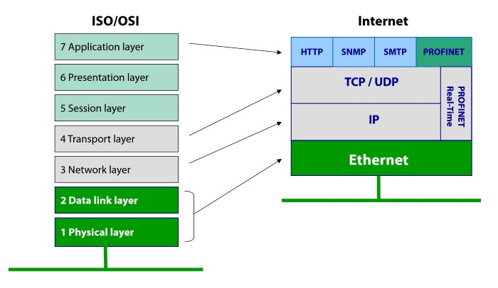

## Profinet DCP

Use **profinet_scanner.py** to detect devices on a network!

SCADA-safe scanner: https://www.rapid7.com/db/modules/auxiliary/scanner/scada/profinet_siemens

Once the devices are identiied, MiTM, packet record/replay attacks can be used as there is no security on the protocol!

To scan from outside, the default port ued are: port 34962-64

### Conclusions

Resources and bibliography:

  * **Industrial Cybersecurity - Efficiently secure critical infrastructure systems** by *Pascal Ackerman*
  * **Cybersecurity for Industrial Control Systems: SCADA, DCS, PLC, HMI, and SIS** by *T. Macaulay, B. L. Singer*
  * Tools source: https://github.com/Boxbop/scada-tools