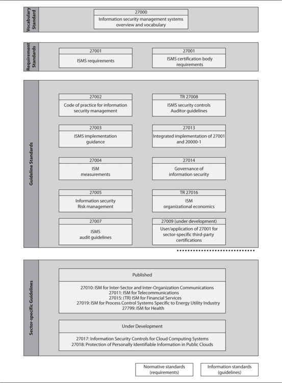

## List of security standards

•  National Institute of Standards and Technology (NIST) Special Publication 800-82 (http://csrc.nist.gov/publications/nistpubs/800-82/SP800-82-final.pdf)

•  International Society of Automation (ISA)/IEC 62443 (https://www.isa.org/templates/two-column.aspx?pageid=121797)

•  North American Electric Reliability Corporation Critical Infrastructure Protection (NERC CIP) Reliability Standards (http://www.nerc.com/pa/Stand/Pages/CIPStandards.aspx)

•  American Petroleum Institute (API) 1164, “Pipeline SCADA Security” (https://global.ihs.com/doc_detail.cfm?document_name=API%20STD%201164)

•  U.S. Department of Homeland Security (DHS) Chemical Facility Anti-Terrorism Standards (CFATS) (https://www.dhs.gov/chemical-facility-anti-terrorism-standards)

•  **U.S. Nuclear Regulatory Commission (NRC)** (http://www.nrc.gov/)

•  Nuclear Energy Institute (NEI) 08-09 (http://www.nrc.gov/docs/ML1011/ML101180437.pdf)

•  National Institute of Standards and Technology (NIST) Cybersecurity Framework (http://www.nist.gov/cyberframework/)

•  National Institute of Standards and Technology (NIST) Special Publication 800-53 (http://www.nist.gov/manuscript-publication-search.cfm?pub_id=915447)

•  ISO/IEC 27001 and 27002 (http://www.27000.org/)

•  Publications of the European Union Agency for Network and Information Security (ENISA) (https://www.enisa.europa.eu/publications)

